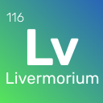

# Normative Control
Normative Control service
#  +  +  = 

Written using [Kotlin](https://kotlinlang.org/) by Mæa Softworks with ❤
### Links
[REST API documentation](https://normative-control-api.herokuapp.com/docs)

[Web App](https://normative-control.herokuapp.com/)

[Frontend application repository](https://github.com/EliteHacker228/normative-control)